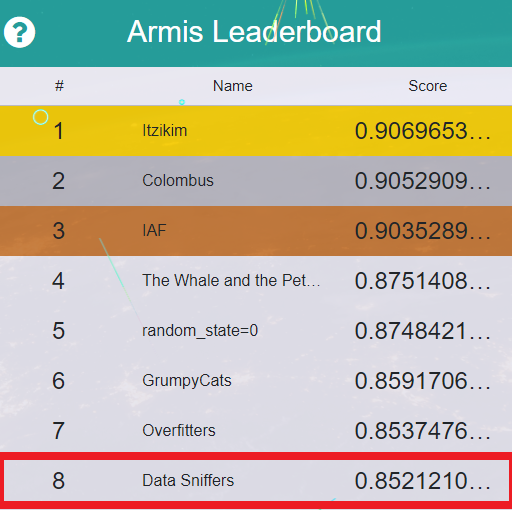

# DataHack2019-Armis-Solution

Our solution to the Armis challenge at DataHack2019.

The Challenge original repo: 
https://github.com/armis-security/DataHack2019

## we were at the 8th place



## What are the things in this repo
### Overview
There are three parts to the code:
- **feature exploration**: We used groupby in order to aggregate the data by device ID\network ID. We checked the corraletion between the different variables, so we were able to delete unnecessary columns. 
- **extract features**: We defined the function which will be responsible to _detected the anomaly_
- **submission**: Submission of the results and receiving the score

## Quick reproduce of the results
As long as the leaderboard is working you can run this code and it will actually submit the result.

### The printout should be:

```
{'member': 'Data Sniffers', 'rank': 8, 'score': 0.8486555135349111}
```

### Running the model - the method we used in the hackathon
In order to run the model in the hackathon on sevral machines, we didn't have all access to a 30GB ram server, so we used google collab instead. In addition to that, we wrote a script which split the data into 30 part; this was a nice way to handle the massive data amount.
